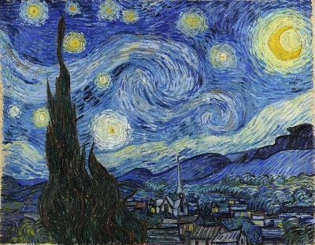
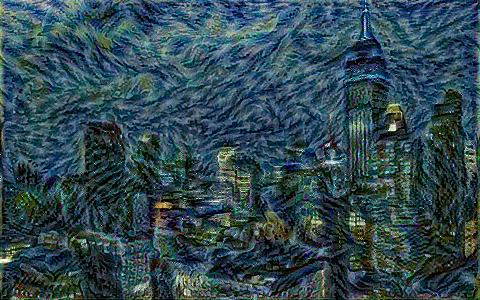

# img2style

`img2style` is an AI-based image style transfer program using TensorFlow and Keras. This program applies the artistic style of one image (style image) to another image (content image) using a convolutional neural network based on the VGG19 model.

## Example
| Content Image | Style Image |
|---------------|-------------|
|  |  |

### Result

| Result Image |
|--------------|
|  |


## Requirements

- Python 3.6 or later
- TensorFlow 2.x
- Keras
- NumPy
- Matplotlib
- PIL (Pillow)

## Installation

1. Clone the repository:
    ```bash
    git clone https://github.com/yourusername/img2style.git
    cd img2style
    ```

2. Install the required Python packages:
    ```bash
    pip install tensorflow keras numpy matplotlib pillow
    ```

## Usage

1. Open the Jupyter Notebook:
    ```bash
    jupyter notebook img2style.ipynb
    ```

2. Upload your content and style images. Make sure the images are in JPEG format.

3. The notebook will guide you through the following steps:
    - Display the content and style images.
    - Preprocess the images.
    - Define the VGG19 model and extract features from the content and style layers.
    - Compute the content and style losses.
    - Perform the style transfer using gradient descent.

4. The result of the style transfer will be displayed after a specified number of iterations.

## Parameters

- `num_iterations`: Number of iterations for the optimization (default: 100).
- `content_weight`: Weight for the content loss (default: 1e3).
- `style_weight`: Weight for the style loss (default: 1e-2).

## Notes

- The process works faster if the images are smaller.
- Adjust the content and style weights to achieve the desired balance between content and style in the output image.

## License

This project is licensed under the MIT License. See the [LICENSE](LICENSE) file for details.

## Contributing

Contributions are welcome! Please fork the repository and submit a pull request for any enhancements or bug fixes.
